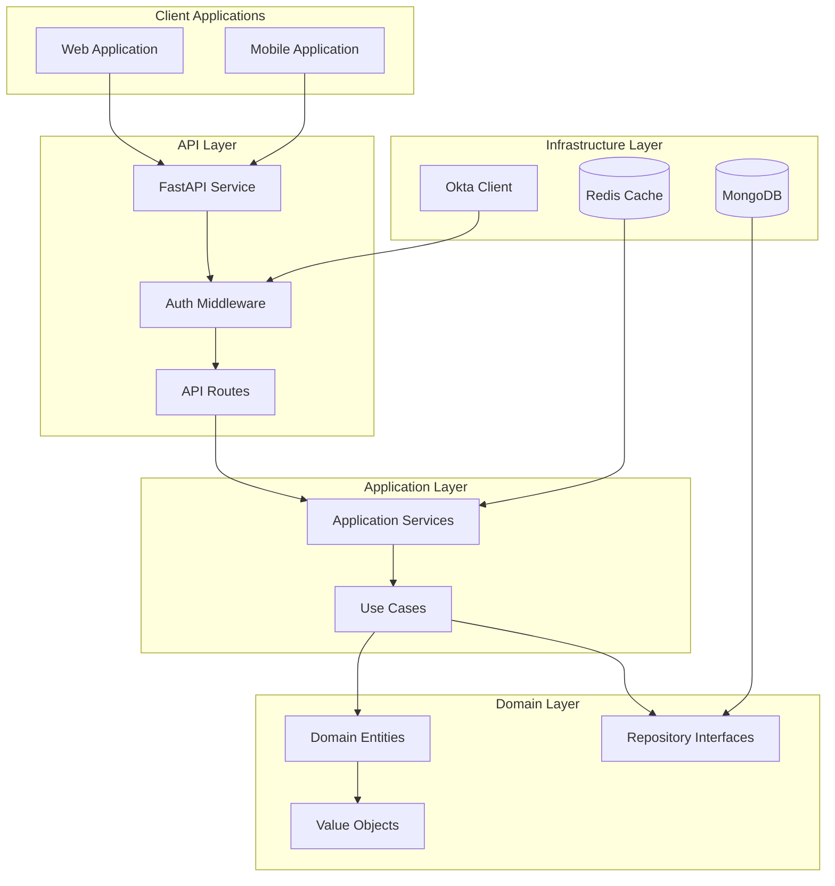
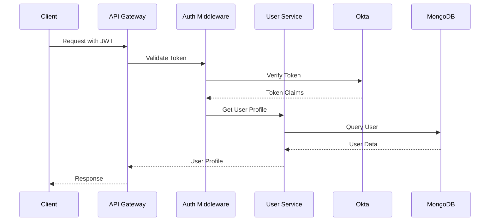
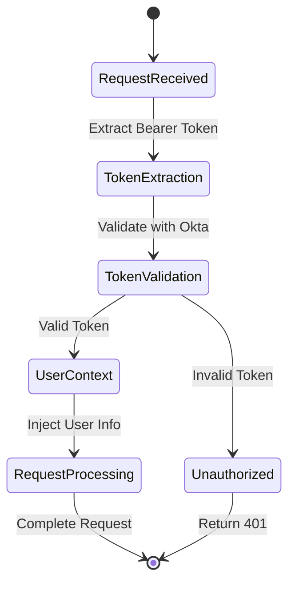
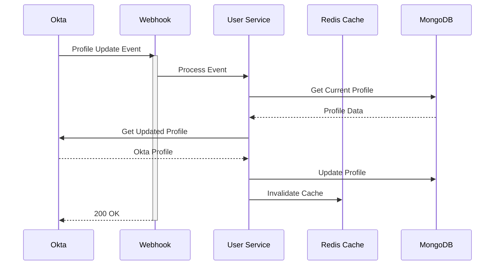
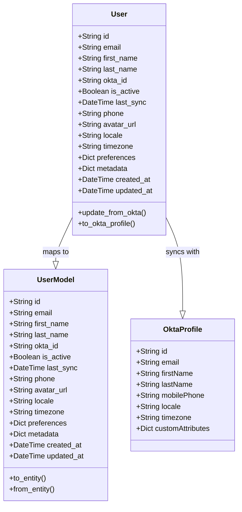
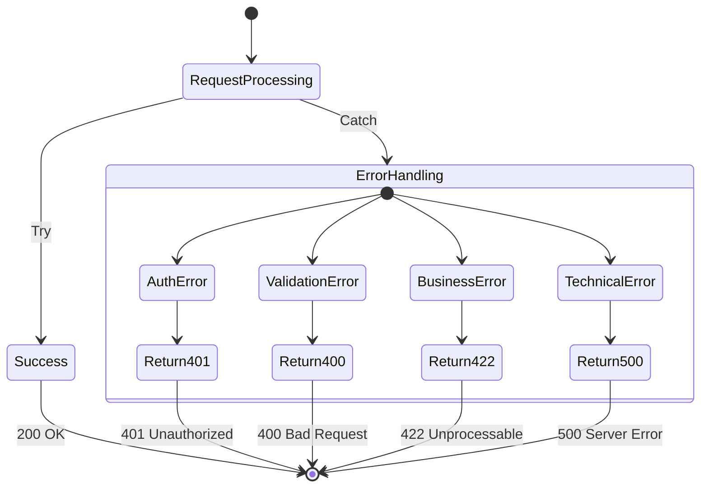
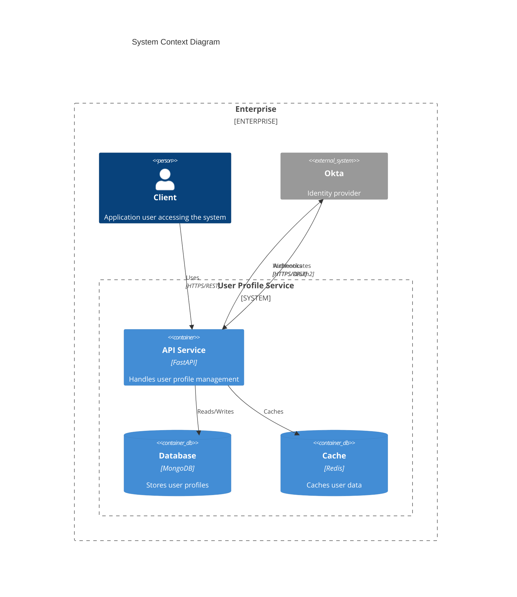
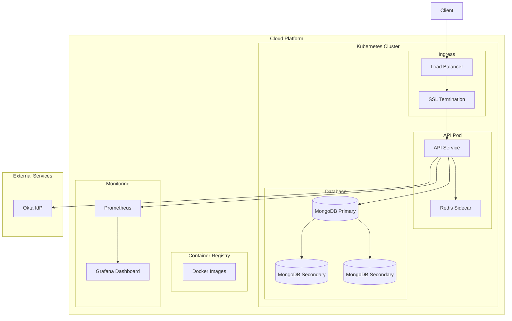
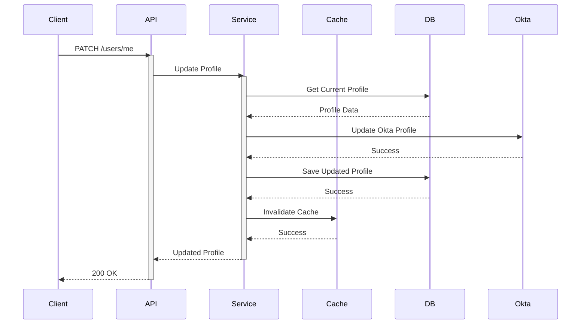
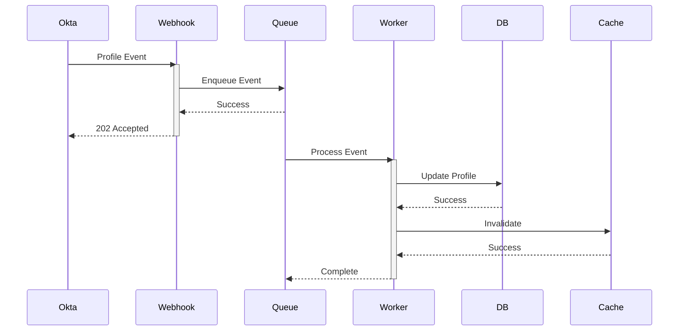

# Design Diagrams

## Table of Contents
- [Architecture Overview](#architecture-overview)
- [Component Interactions](#component-interactions)
- [Authentication Flow](#authentication-flow)
- [Profile Sync Flow](#profile-sync-flow)
- [Data Model](#data-model)
- [Error Handling Flow](#error-handling-flow)

[← Back to Main Documentation](../README.md)

## Architecture Overview

## Component Interactions

## Authentication Flow

## Profile Sync Flow

## Data Model

## Error Handling Flow

## System Context

## Deployment Architecture

## Sequence Flows

### User Profile Update

### Webhook Processing

